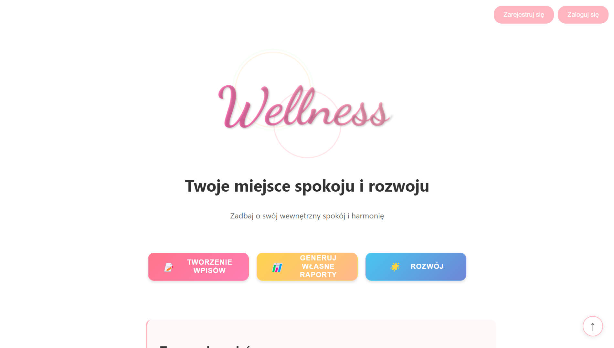

# 🌿 Wellness

**Wellness** to aplikacja, która w subtelny i nienachalny sposób wspiera użytkownika w poprawie samopoczucia, oferując możliwość prowadzenia osobistego pamiętnika.

---

> Projekt stworzony podczas hackathonu przez zespół **No Time To Debug**

👨‍💻 **Frontend**:  
- [Adzikoo](https://github.com/Adzikoo)  
- [Szymon110903](https://github.com/Szymon110903)

🧠 **Backend**:  
- [blanqtoja](https://github.com/blanqtoja)  
- [mateuszciolkowski](https://github.com/mateuszciolkowski)

---

## 🧠 Opis działania

Każdego dnia aplikacja, z wykorzystaniem sztucznej inteligencji, analizuje ostatni wpis w pamiętniku i na jego podstawie generuje trzy spersonalizowane pytania.  
Użytkownik odpowiada na nie, a odpowiedzi są przetwarzane przez algorytm, który ocenia aktualne samopoczucie w skali od 1 do 100.

Wyniki zapisywane są w bazie danych, co umożliwia tworzenie wykresu nastroju – pozwalającego śledzić zmiany samopoczucia w czasie.
Dodatkowo użytkownik może przeglądać historię wpisów w pamiętniku, co umożliwia śledzenie swoich zmian w samopoczucie. Zapewniliśmy równiez dla uztykownika mozliwosc rozmowy z witrualnym psychologiem dzialajacego w oparciu o sztuczna inteligencje za pośrednictwem czatu.
---

## 📊 Planowany rozwój

W kolejnych etapach planujemy wprowadzenie funkcji generowania raportów, które będą zawierały:

- analizę odpowiedzi na pytania,
- wykresy samopoczucia,
- wskazówki, co pozytywnie lub negatywnie wpływa na nastrój.

Raporty mogą również stanowić cenne wsparcie w kontaktach z psychologiem lub jako narzędzie samopoznania.

---

## 🛠️ Stack technologiczny

| Warstwa    | Technologia        |
|------------|--------------------|
| **Frontend** | JavaScript (React.js) |
| **Backend**  | Python (FastAPI)      |
| **AI API**   | OpenAI API            |
| **Baza danych** | PostgreSQL         |
| **Inne**     | Docker                |

---

## 📸 Zrzuty ekranu

---

🧘 *Wellness – bo każdy dzień zasługuje na chwilę refleksji.*